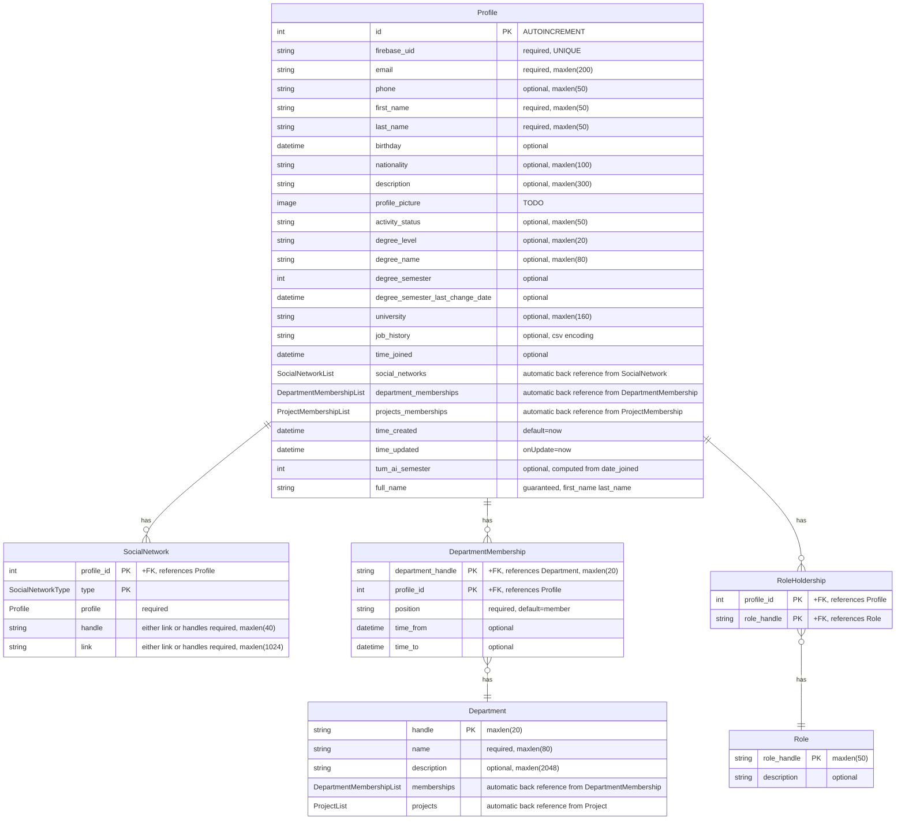

# ERD for TUMai space database (& backend)

```mermaid
erDiagram
    %% ================================
    %% PROFILE SERVICE
    Department {
        %% managed fields
        string handle PK "maxlen(20)"

        %% userchangable fields
        string name "required, maxlen(80)"
        string description "optional, maxlen(2048)"

        %% relationalfk fields
        DepartmentMembershipList memberships "automatic back reference from DepartmentMembership"
        ProjectList projects "automatic back reference from Project"
    }
    Profile {
        %% managed fields
        int id PK "AUTOINCREMENT"
        string firebase_uid "required, UNIQUE"

        %% userchangable fields
        string email "required, maxlen(200)"
        string phone "optional, maxlen(50)"
        string first_name "required, maxlen(50)"
        string last_name "required, maxlen(50)"
        datetime birthday "optional"
        string nationality "optional, maxlen(100)"
        string description "optional, maxlen(300)"
        image profile_picture  "TODO"
        string activity_status "optional, maxlen(50)"

        string degree_level "optional, maxlen(20)"
        string degree_name "optional, maxlen(80)"
        int degree_semester "optional"
        datetime degree_semester_last_change_date "optional"
        string university "optional, maxlen(160)"

        %% format <> 
        %% escaping of control characters
        string job_history "optional, csv encoding"

        %% supervisorchangable fields
        datetime time_joined "optional"

        %% relationalfk fields
        SocialNetworkList social_networks "automatic back reference from SocialNetwork"
        DepartmentMembershipList department_memberships "automatic back reference from DepartmentMembership"
        ProjectMembershipList projects_memberships "automatic back reference from ProjectMembership"

        %% computed/automated fields
        datetime time_created "default=now"
        datetime time_updated "onUpdate=now"
        int tum_ai_semester "optional, computed from date_joined"
        string full_name "guaranteed, first_name last_name"
    }
    SocialNetwork {
        %% managed fields
        int profile_id PK "+FK, references Profile"
        SocialNetworkType type PK
        Profile profile "required"

        %% userchangable fields
        string handle "either link or handles required, maxlen(40)"
        string link "either link or handles required, maxlen(1024)"
    }
    DepartmentMembership {
        %% managed fields
        string department_handle PK "+FK, references Department, maxlen(20)"
        int profile_id PK "+FK, references Profile"

        %% supervisorchangable fields
        string position "required, default=member"
        datetime time_from "optional"
        datetime time_to "optional"
    }
    Role {
        string role_handle PK "maxlen(50)"
        string description "optional"
    }
    RoleHoldership {
    	int profile_id PK "+FK, references Profile"
    	string role_handle PK "+FK, references Role"
    }
    %% ================================
    %% relations

    %% PROFILE SERVICE
    Profile ||--o{ SocialNetwork: has

    Profile ||--o{ DepartmentMembership: has
    DepartmentMembership }o--|| Department: has

    Profile ||--o{ RoleHoldership: has
    RoleHoldership }o--|| Role: has
```
