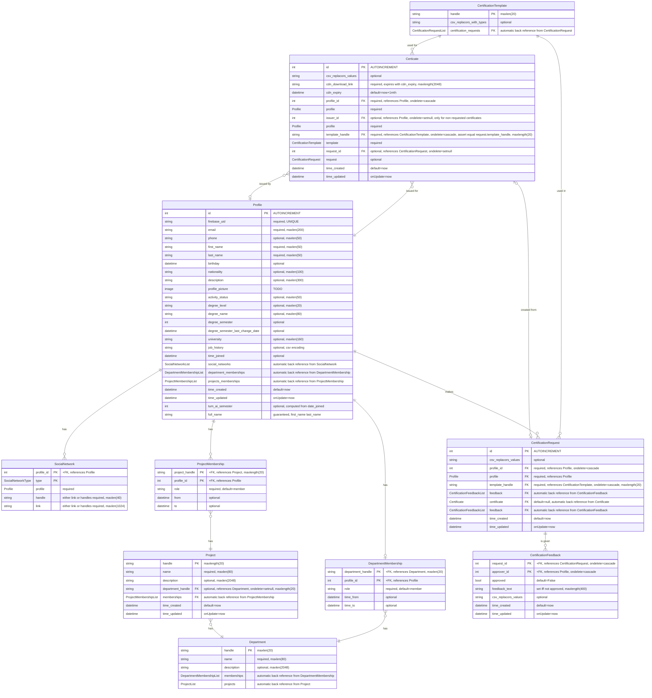

# ERD for TUMai space database (& backend)

Full file with comments can be found in /docs/erDiagram.
Strip comment lines `.*//.*\n` to make it renderable.

```mermaid
erDiagram
    %% PROFILE SERVICE
    Department {
        string handle PK "maxlen(20)"

        string name "required, maxlen(80)"
        string description "optional, maxlen(2048)"

        DepartmentMembershipList memberships "automatic back reference from DepartmentMembership"
        ProjectList projects "automatic back reference from Project"
    }
    Profile {
        int id PK "AUTOINCREMENT"
        string firebase_uid "required, UNIQUE"

        string email "required, maxlen(200)"
        string phone "optional, maxlen(50)"
        string first_name "required, maxlen(50)"
        string last_name "required, maxlen(50)"
        datetime birthday "optional"
        string nationality "optional, maxlen(100)"
        string description "optional, maxlen(300)"
        image profile_picture  "TODO"
        string activity_status "optional, maxlen(50)"

        string degree_level "optional, maxlen(20)"
        string degree_name "optional, maxlen(80)"
        int degree_semester "optional"
        datetime degree_semester_last_change_date "optional"
        string university "optional, maxlen(160)"

        string job_history "optional, csv encoding"

        datetime time_joined "optional"

        SocialNetworkList social_networks "automatic back reference from SocialNetwork"
        DepartmentMembershipList department_memberships "automatic back reference from DepartmentMembership"
        ProjectMembershipList projects_memberships "automatic back reference from ProjectMembership"

        datetime time_created "default=now"
        datetime time_updated "onUpdate=now"
        int tum_ai_semester "optional, computed from date_joined"
        string full_name "guaranteed, first_name last_name"
    }
    SocialNetwork {
        int profile_id PK "+FK, references Profile"
        SocialNetworkType type PK
        Profile profile "required"

        string handle "either link or handles required, maxlen(40)"
        string link "either link or handles required, maxlen(1024)"
    }
    DepartmentMembership {
        string department_handle PK "+FK, references Department, maxlen(20)"
        int profile_id PK "+FK, references Profile"

        string role "required, default=member"
        datetime time_from "optional"
        datetime time_to "optional"
    }
    %% PROJECT SERVICE
    Project {
        string handle PK "maxlength(20)"

        string name "required, maxlen(80)"
        string description "optional, maxlen(2048)"


        string department_handle FK "optional, references Department, ondelete=setnull, maxlength(20)"
        ProjectMembershipList memberships FK "automatic back reference from ProjectMembership"

        datetime time_created "default=now"
        datetime time_updated "onUpdate=now"
    }
    ProjectMembership {
        string project_handle PK "+FK, references Project, maxlength(20)"
        int profile_id PK "+FK, references Profile"

        string role "required, default=member"
        datetime from "optional"
        datetime to "optional"
    }
    %% CERTIFICATION SERVICE

    CertificationTemplate {
        string handle PK "maxlen(20)"
        
        string csv_replacors_with_types "optional"

        CertificationRequestList certification_requests FK "automatic back reference from CertificationRequest"
    }
    CertificationRequest {

        int id PK "AUTOINCREMENT"

        string csv_replacors_values "optional"

        int profile_id FK "required, references Profile, ondelete=cascade"
        Profile profile FK "required, references Profile"

        string template_handle FK "required, references CertificationTemplate, ondelete=cascade, maxlength(20)"
        CertificationFeedbackList feedback FK "automatic back reference from CertificationFeedback"

        Certificate certificate FK "default=null, automatic back reference from Certificate"
        CertificationFeedbackList feedback FK "automatic back reference from CertificationFeedback"

        datetime time_created "default=now"
        datetime time_updated "onUpdate=now"
    }
    CertificationFeedback {
        int request_id PK "+FK, references CertificationRequest, ondelete=cascade"
        int approver_id PK "+FK, references Profile, ondelete=cascade"

        bool approved "default=False"
        string feedback_text "set iff not approved, maxlength(400)"
        string csv_replacors_values "optional"

        datetime time_created "default=now"
        datetime time_updated "onUpdate=now"
    }
    Certicate {
        int id PK "AUTOINCREMENT"

        string csv_replacors_values "optional"
        string cdn_download_link "required, expires with cdn_expiry, maxlength(2048)"
        datetime cdn_expiry "default=now+1mth"

        int profile_id FK "required, references Profile, ondelete=cascade"
        Profile profile "required"

        int issuer_id FK "optional, references Profile, ondelete=setnull, only for non requested certificates"
        Profile profile "required"

        string template_handle FK "required, references CertificationTemplate, ondelete=cascade, assert equal request.template_handle, maxlength(20)"
        CertificationTemplate template "required"

        int request_id FK "optional, references CertificationRequest, ondelete=setnull"
        CertificationRequest request "optional"

        datetime time_created "default=now"
        datetime time_updated "onUpdate=now"
    }

    %% relations

    %% PROFILE SERVICE
    Profile ||--o{ SocialNetwork: has

    Profile ||--o| DepartmentMembership: has 
    DepartmentMembership }o--|| Department: has

    %% PROJECT SERVICE
    Profile ||--o{ ProjectMembership: has 
    ProjectMembership }o--|| Project: has
    Project }o--|| Department: has

    %% CERTIFICATION SERVICE
    CertificationTemplate ||--o{ CertificationRequest: "used in"
    Profile ||--o{ CertificationRequest: makes
    CertificationRequest ||--o{ CertificationFeedback: "is given"

    Certicate }o--|| Profile: "issued for"
    Certicate }o--o| Profile: "issued by"
    CertificationTemplate ||--o{ Certicate: "used for"
    Certicate |o--o| CertificationRequest: "created from"
```

