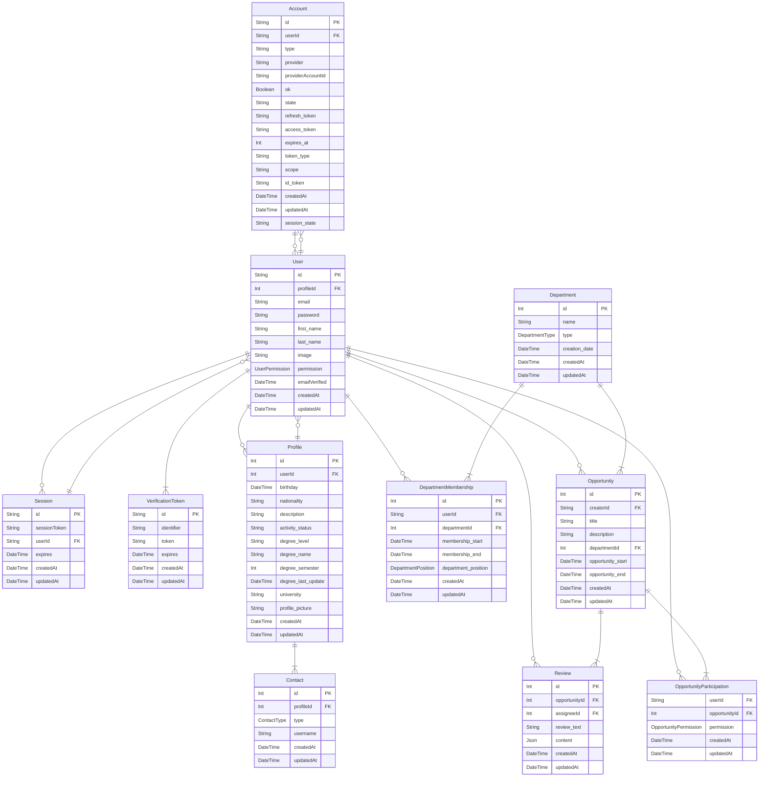

```mermaid
erDiagram
    Account ||--o{ User : ""
    Account {
        String id PK
        String userId FK
        String type
        String provider
        String providerAccountId
        Boolean ok
        String state
        String refresh_token
        String access_token
        Int expires_at
        String token_type
        String scope
        String id_token
        DateTime createdAt
        DateTime updatedAt
        String session_state
    }

    Session ||--o{ User : ""
    Session {
        String id PK
        String sessionToken
        String userId FK
        DateTime expires
        DateTime createdAt
        DateTime updatedAt
    }

    User ||--|{ VerificationToken : ""
    User ||--o{ Profile : ""
    User ||--o{ DepartmentMembership : ""
    User ||--o{ Opportunity : ""
    User ||--o{ OpportunityParticipation : ""
    User ||--o{ Review : ""
    User ||--o{ Account : ""
    User ||--o{ Session : ""
    User {
        String id PK
        Int profileId FK
        String email
        String password
        String first_name
        String last_name
        String image
        UserPermission permission
        DateTime emailVerified
        DateTime createdAt
        DateTime updatedAt
    }

    VerificationToken {
        String id PK
        String identifier
        String token
        DateTime expires
        DateTime createdAt
        DateTime updatedAt
    }

    Profile ||--|{ Contact : ""
    Profile ||--o{ User : ""
    Profile {
        Int id PK
        Int userId FK
        DateTime birthday
        String nationality
        String description
        String activity_status
        String degree_level
        String degree_name
        Int degree_semester
        DateTime degree_last_update
        String university
        String profile_picture
        DateTime createdAt
        DateTime updatedAt
    }

    Contact {
        Int id PK
        Int profileId FK
        ContactType type
        String username
        DateTime createdAt
        DateTime updatedAt
    }

    Department ||--|{ DepartmentMembership : ""
    Department ||--|{ Opportunity : ""
    Department {
        Int id PK
        String name
        DepartmentType type
        DateTime creation_date
        DateTime createdAt
        DateTime updatedAt
    }

    DepartmentMembership {
        Int id PK
        String userId FK
        Int departmentId FK
        DateTime membership_start
        DateTime membership_end
        DepartmentPosition department_position
        DateTime createdAt
        DateTime updatedAt
    }

    Opportunity ||--|{ Review : ""
    Opportunity ||--|{ OpportunityParticipation : ""
    Opportunity {
        Int id PK
        String creatorId FK
        String title
        String description
        Int departmentId FK
        DateTime opportunity_start
        DateTime opportunity_end
        DateTime createdAt
        DateTime updatedAt
    }

    OpportunityParticipation {
        String userId FK
        Int opportunityId FK
        OpportunityPermission permission
        DateTime createdAt
        DateTime updatedAt
    }

    Review {
        Int id PK
        Int opportunityId FK
        Int assigneeId FK
        String review_text
        Json content
        DateTime createdAt
        DateTime updatedAt
    }
```
